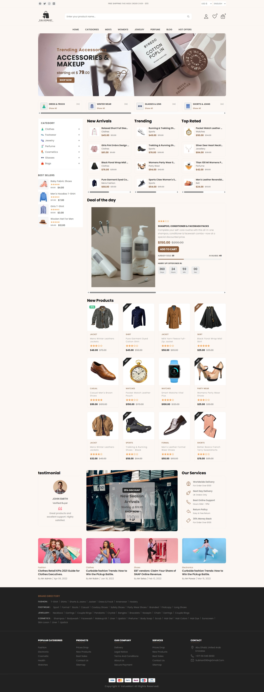
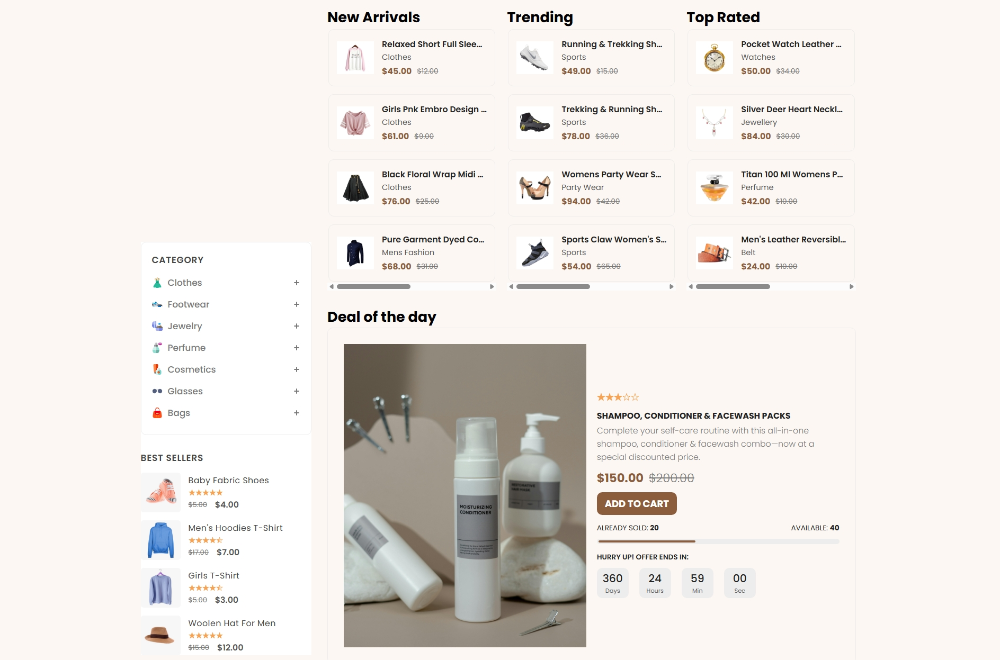
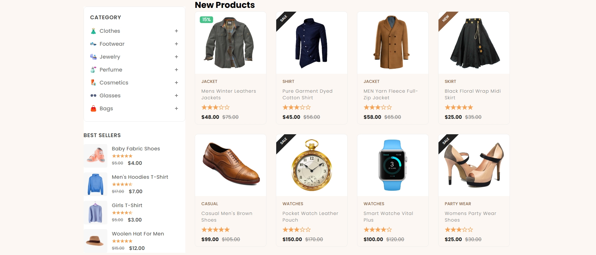
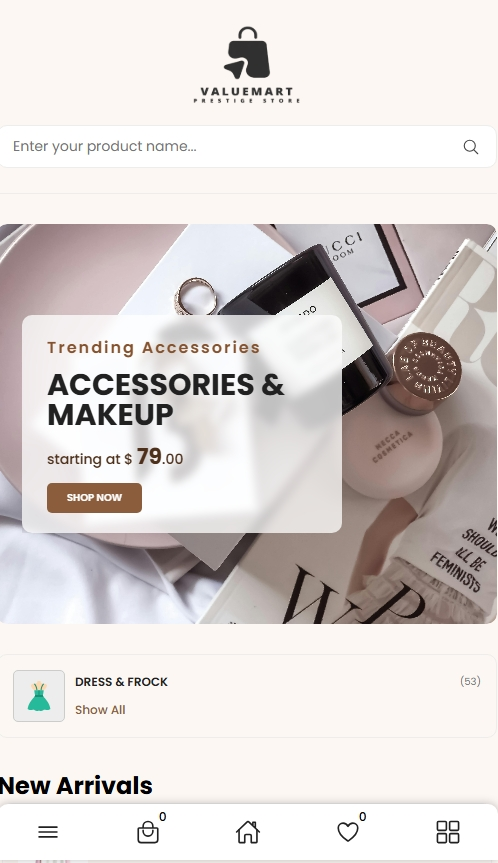
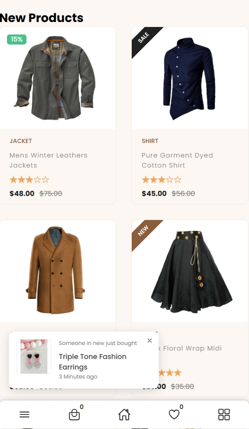

# Luxury E-Commerce Store

A premium and modern e-commerce platform designed to showcase luxury fashion, accessories, and lifestyle products with an elegant and minimal user experience.

---

## 📌 Overview

This project is a luxury-themed online store built with a clean UI and responsive design to ensure a smooth browsing experience across all devices.

---

## 📸 Screenshots

### Home Page


### Product Page



### Mobile View



---

## ✨ Features

- Clean and modern luxury UI design  
- Fully responsive (mobile, tablet, desktop)  
- Smooth navigation experience  
- Organized product display  
- Elegant visual styling  
- Lightweight and fast performance  

---

## 🛠️ Tech Stack

- HTML5  
- CSS3  
- JavaScript  

---

## 📁 Project Structure

E-COMMERCE WEBSITE/
├── index.html
├── README.md
|
├── assets/
|   ├── css/
|   |    └── style.css
|   ├──  js/
|   |    └── script.js
|   ├── images/
|   |   ├── icons/
|   |   ├── logo/
|   |   ├── products/
|   |   └── screenshots/

---

## 🏃‍♂️ Run Locally

```bash
# Clone repository
git clone https://github.com/Subhan46-web/ecommerce-website.git

# Navigate to project folder
cd ecommerce-website

# Open in browser
# Open index.html in your browser

---

## 👤 Author
- Name: Subhan Raza
- GitHub: https://github.com/Subhan46-web
- LinkedIn: linkedin.com/in/subhan-raza-b8b892303