# ValueMart Storefront

ValueMart is a responsive e-commerce storefront built with HTML, CSS, and JavaScript. It combines a polished luxury-inspired UI with practical shopping interactions such as cart and wishlist panels, responsive sliders, mobile navigation, and tablet-friendly layout fixes.

## Overview

This project is a single-page storefront experience focused on:

- clean product discovery
- responsive browsing across mobile, tablet, and desktop
- interactive cart and wishlist flows
- lightweight frontend performance without frameworks

## Features

- Responsive layout for mobile, tablet, and desktop
- Refined storefront visual theme with custom typography and warm neutral gradients
- Sticky header with compact scroll behavior
- Mobile bottom navigation with cart, wishlist, home, hamburger menu, and grid menu
- Smooth scroll-to-top action from the mobile home button
- Responsive hero banner with multiple CTA links
- Category slider with in-card mobile navigation arrows
- Product showcase sliders for `New Arrivals`, `Trending`, and `Top Rated`
- Tablet layout adjustments to keep the three product columns aligned in one row
- Commerce-ready product cards with:
  - add to cart
  - add to wishlist
  - wishlist state toggling
  - compact product actions
- Slide-in cart and wishlist panel with:
  - saved item rendering
  - quantity controls
  - subtotal calculation
  - move-to-wishlist action
  - move-to-cart action
  - empty states
- Mobile cart and wishlist experience optimized as a full-screen panel
- Mobile/tablet header behavior adjusted when cart or wishlist is opened
- Mobile menu and category sidebar behavior fixed to open correctly from anywhere on the page
- Tablet navigation fallback to the mobile nav flow to avoid broken desktop mega-menu behavior
- Sales notification toast styled to match the storefront theme and positioned above the mobile bottom nav
- Newsletter modal redesigned and centered for mobile
- Basic multilingual text switching support for `EN`, `ES`, and `FR`

## Preview

   ### Desktop Preview

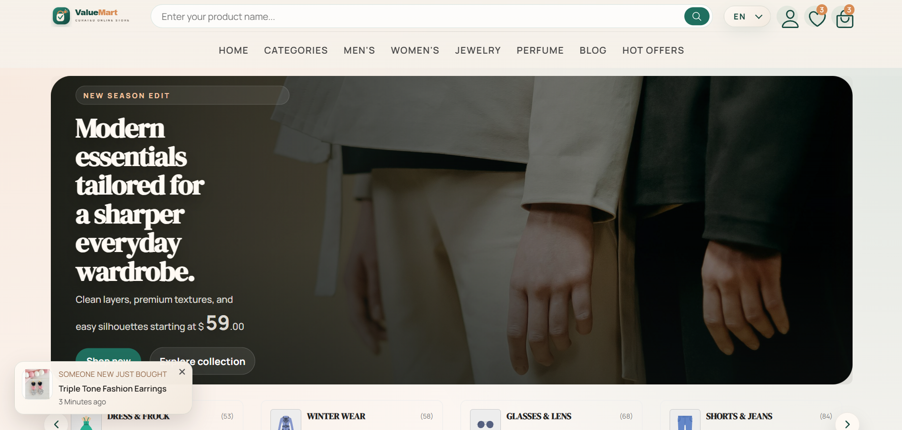
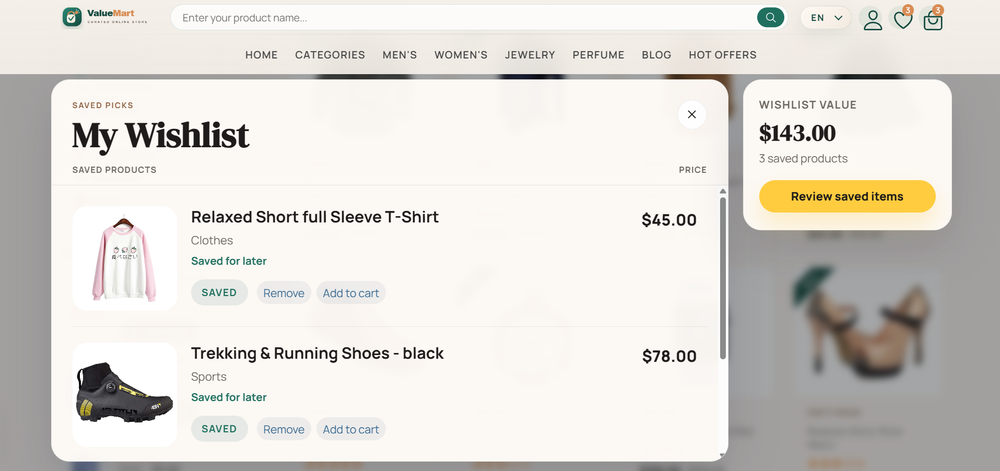
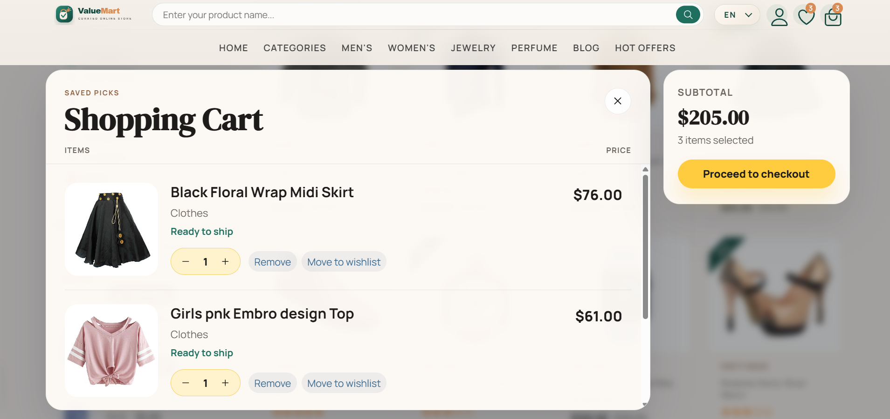
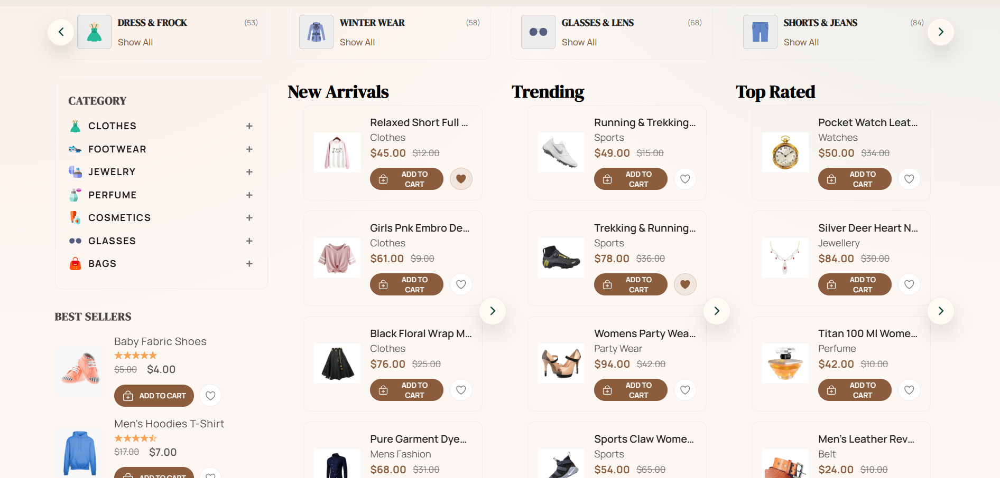
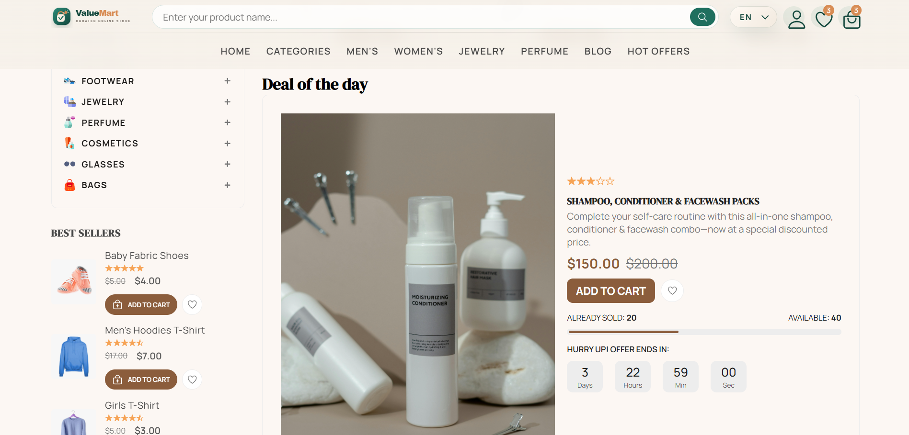
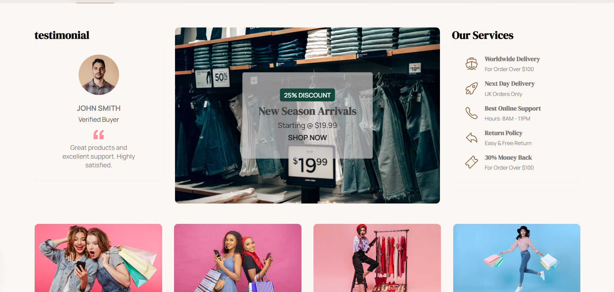
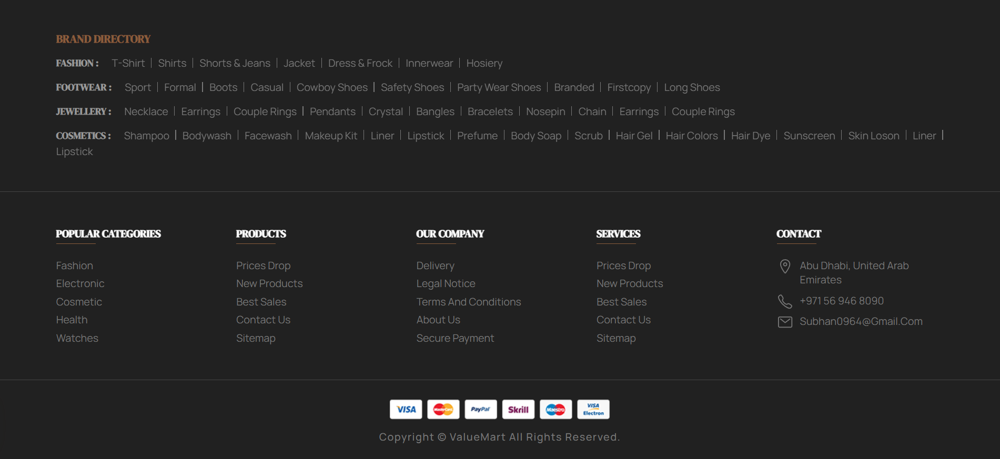


   ### Tablet Preview


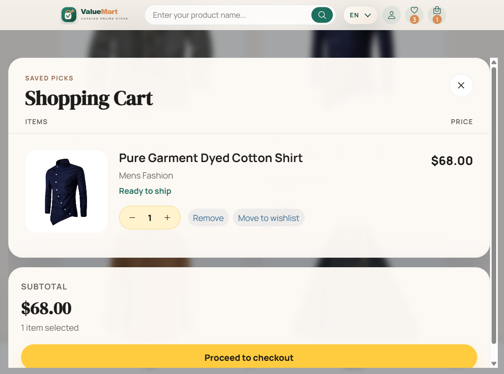
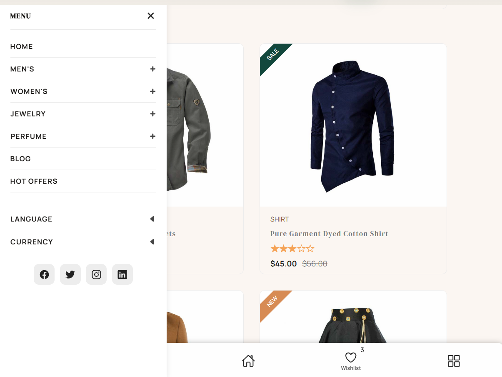

  ### Mobile Preview

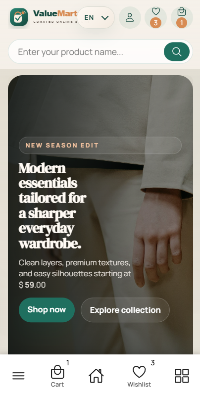 
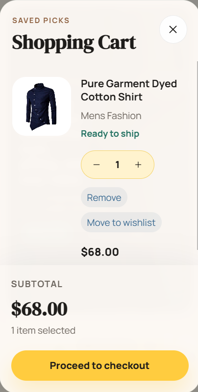 
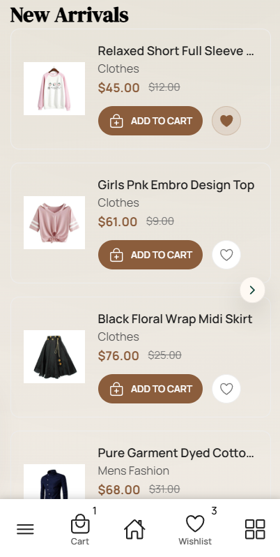 
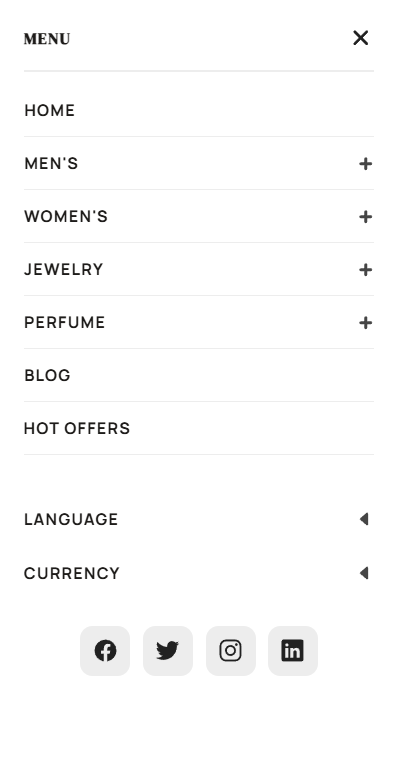 
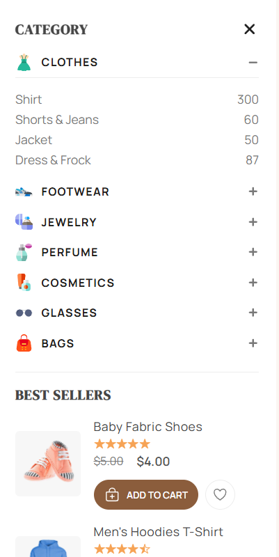 

## Responsive Improvements Added

The current version includes a substantial set of UI fixes and enhancements:

- Mobile hero/header spacing cleanup
- Mobile menu layering fixes so controls do not hide under the hero
- Mobile slider arrow resizing and repositioning
- Mobile cart/wishlist panel improvements
- Mobile bottom navigation pinned to the real screen bottom
- Cart and wishlist counters synchronized across header and mobile nav
- Tablet layout corrections for broken navigation and product sections
- Cleaner sizing and spacing for tablet product cards

## Tech Stack

- HTML5
- CSS3
- JavaScript
- Ionicons
- Google Fonts (`DM Serif Display`, `Manrope`)

## Project Structure

```
E-commerce Website/
├── index.html
├── README.md
└── assets/
    ├── css/
    │   └── style.css
    ├── js/
    │   └── script.js
    └── images/
        ├── icons/
        ├── logo/
        ├── products/
        └── screenshots/
```

## Run Locally

1. Clone the repository:

```bash
git clone https://github.com/Subhan46-web/ecommerce-website.git
```

2. Open the project folder:

```bash
cd ecommerce-website
```

3. Start it with any static server, or open `index.html` directly in your browser.

Example with VS Code Live Server:

```bash
# Open the folder in VS Code and start Live Server
```

## Screenshots

Add or update your latest screenshots inside `assets/images/screenshots/` and reference them here if you want the README gallery to match the newest UI.

## Author

- Name: Subhan Raza
- GitHub: [Subhan46-web](https://github.com/Subhan46-web)
- LinkedIn: [subhan-raza-b8b892303](https://www.linkedin.com/in/subhan-raza-b8b892303)
